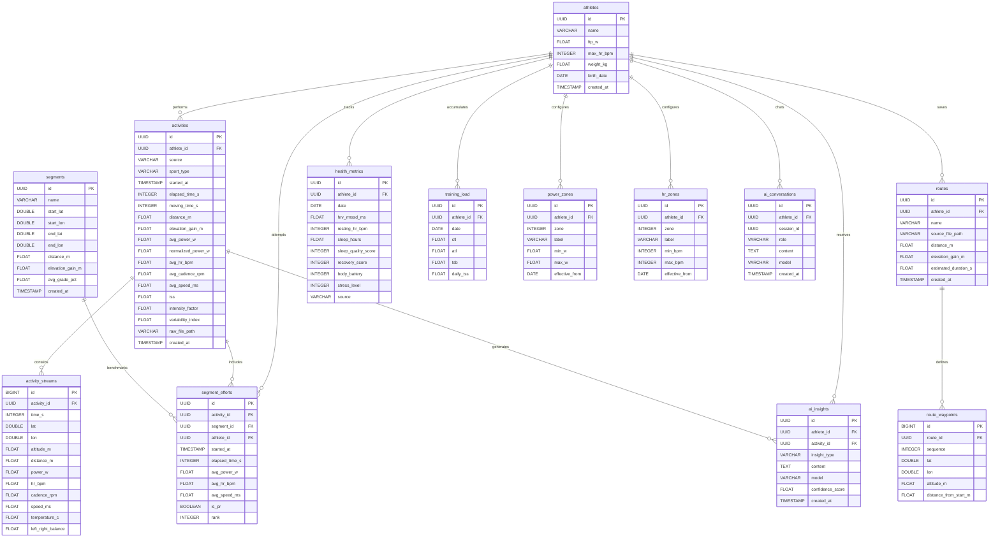

# VeloDNA — Entity Relationship Diagram

## Tabelas — Responsabilidades

| Tabela | Módulo | Descrição |
|---|---|---|
| `athletes` | Core | Perfil único do atleta (FTP, peso, FC máx) |
| `activities` | Training Analytics | Resumo de cada atividade processada |
| `activity_streams` | Training Analytics | Séries temporais brutas (1 row/segundo) |
| `segments` | Route Intelligence | Trechos geográficos de referência |
| `segment_efforts` | Route Intelligence | Performances do atleta em cada segmento |
| `routes` | Route Intelligence | Rotas salvas com traçado completo |
| `route_waypoints` | Route Intelligence | Pontos GPS da rota |
| `health_metrics` | Health Insights | HRV, sono, recuperação por dia |
| `training_load` | Training Analytics | CTL / ATL / TSB diário |
| `power_zones` | Training Analytics | Zonas de potência versionadas por FTP |
| `hr_zones` | Training Analytics | Zonas de FC versionadas |
| `ai_conversations` | AI Coach | Histórico completo de chat |
| `ai_insights` | AI Coach | Insights gerados automaticamente pós-atividade |

## Notas de Design

- `activity_streams` cresce ~3 600 rows/hora de atividade; particionado por `activity_id`.
- `training_load` é recalculado via job diário — não derivado em query.
- `power_zones` e `hr_zones` são versionados por `effective_from` para refletir mudanças de FTP ao longo da temporada.
- `ai_insights.activity_id` é nullable — insights semanais e de recuperação não têm atividade associada.
