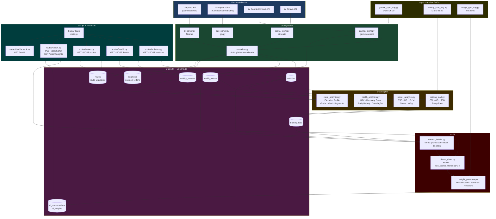
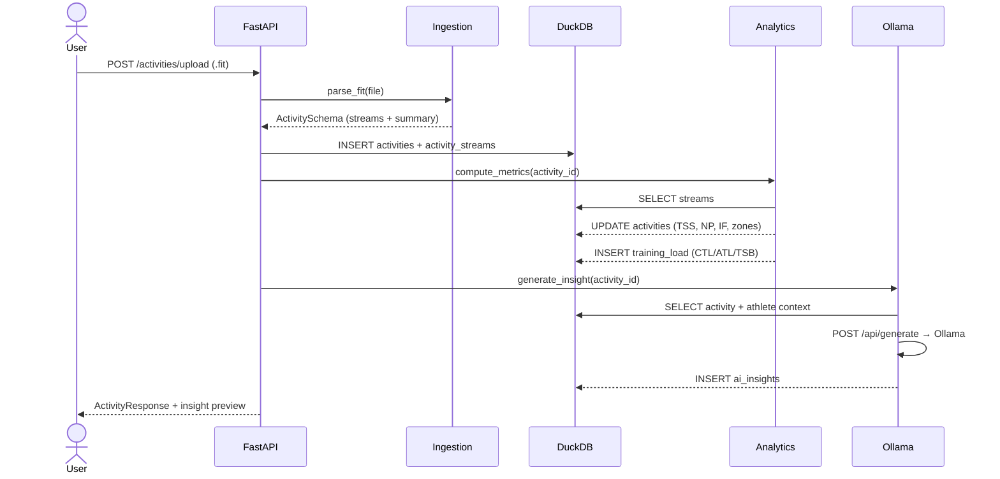
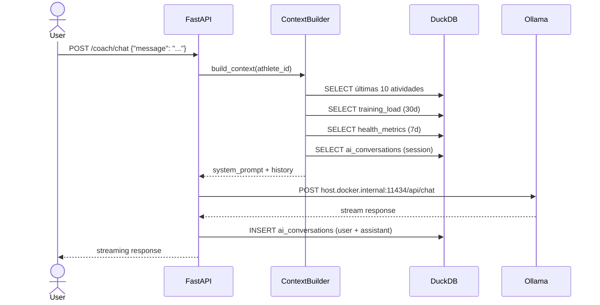

# VeloDNA — Diagrama de Fluxo do Sistema

## Fluxo Completo

## Fluxo de uma Atividade (Happy Path)

## Fluxo do AI Coach (Chat)

## Componentes e Tecnologias

| Camada | Tecnologia | Justificativa |
|---|---|---|
| Ingestion | fitparse, gpxpy, stravalib, garminconnect | Parsers nativos por formato |
| Storage | DuckDB | OLAP local, zero infra, queries analíticas rápidas |
| Analytics | pandas, numpy, scipy, scikit-learn | Ecossistema científico Python |
| API | FastAPI + uvicorn | Async, tipagem Pydantic, OpenAPI automático |
| AI | Ollama (llama3 / mistral) | 100% local, sem custo por token, privacidade total |
| Orchestration | Apache Airflow | DAGs versionados, retry, scheduling |
| dbt | dbt-duckdb | Transformações SQL versionadas sobre DuckDB |
